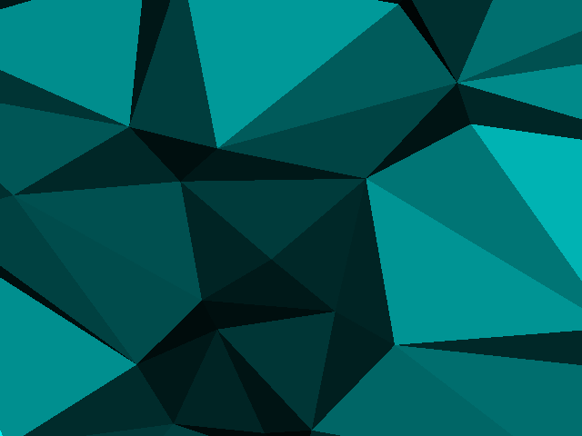
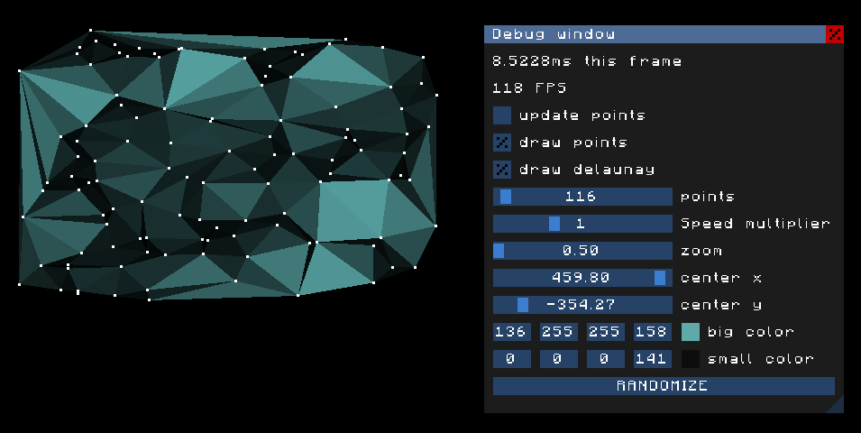

# Delaunay
Implementation of Delaunay triangulation



## Building
```
$ git clone --recurse-submodules git@github.com:GitHuberlandYann/Delaunay.git
$ cd Delaunay
$ make setup
$ make
$ ./delaunay
```
make setup will install the needed [static libraries.](#libraries)

make will create the executable 'delaunay'.

## Controls
F3    - open/close gui window

R     - create new set of points

mouse - toggle options and move sliders on said gui window

## GUI
I coded my own Gui window management. It allows to create several customizable gui windows on screen, on which you can add sliders, display values, modify color channels, and more. It was inspired from [Dear ImGui.](https://github.com/ocornut/imgui.git)



## Libraries
* [GLFW](https://github.com/glfw/glfw.git) is an Open Source, multi-platform library for OpenGL, OpenGL ES and Vulkan application development. It provides a simple, platform-independent API for creating windows, contexts and surfaces, reading input, handling events, etc.
* [GLEW](https://github.com/nigels-com/glew.git) provides efficient run-time mechanisms for determining which OpenGL extensions are supported on the target platform. I am using the [latest stable version.](https://github.com/nigels-com/glew/releases/tag/glew-2.2.0)
* [SOIL](https://github.com/littlstar/soil.git) is a tiny C library used primarily for uploading textures into OpenGL.
